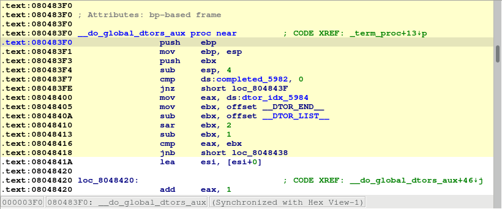

:revn: 0.2
:revd: March 31
:revy: 2021
:ida_version: 7.6
:IDAMAJMIN: 76

= Debugging Linux/Windows Applications with PIN Tracer module

Last updated on {revd}, {revy} — v{revn}

== Introduction

The PIN tracer is a remote debugger plugin used to record execution
traces. It allows to record traces on Linux and Windows (x86 and x86_64)
from any of the supported IDA platforms (Windows, Linux and MacOSX).
Support for MacOSX targets is not yet available.

=== PIN support for MacOSX 

Recording traces on MacOSX target is not supported yet.

However, it's possible to record traces from a Linux or Windows target
using the MacOSX version of IDA.

== Building the PIN tool

Before using the PIN tracer the PIN tool module (distributed only in
source code form) must be built as the Intel PIN license disallows
redistributing PIN tools in binary form.

First of all download PIN from http://www.pintool.org/[http://www.pintool.org] ,
and unpack it on your hard drive.

IMPORTANT: the PIN tools are a little sensitive to spaces in paths. Therefore, we recommend unpacking in a no-space path. E.g., *"C:\pin"*, but not *"C:\Program Files (x86)\"*.

The building process of the PIN tool is different for Windows and Linux.

=== Building on Windows

. Install Visual Studio. It is possible to build the PIN tool with the
Express version of Visual Studio for C++.
. Download the IDA pintool sources from: +
https://www.hex-rays.com/products/ida/support/freefiles/idapin{IDAMAJMIN}.zip[https://www.hex-rays.com/products/ida/support/freefiles/idapin$(IDAMAJMIN).zip] (*)
+
pintool 6.9 and higher should be built with PIN version 3.0 and higher,
for earlier versions of pintool you should use PIN build 65163.
. Unpack the .zip file into /path/to/pin/source/tools/
. Open /path/to/pin/source/tools/idapin/IDADBG.sln in Visual Studio,
select the correct build configuration (either Win32 or x64) and build
the solution.

Alternatively you can use GNU make:

. Install GNU make as a part of cygwin or MinGW package
. Unpack the .zip file into /path/to/pin/source/tools/
. Prepare Visual Studio environment (e.g. %VCINSTALLDIR%\Auxiliary\Build\vcvars32.bat for 32-bit pintool or %VCINSTALLDIR%\Auxiliary\Build\vcvars64.bat for 64-bit one)
. cd /path/to/pin/source/tools/idapin
. make

=== Building on Linux

. Install GCC 3.4 or later
. Download the IDA pintool sources from: +
https://www.hex-rays.com/products/ida/support/freefiles/idapin{IDAMAJMIN}.zip[https://www.hex-rays.com/products/ida/support/freefiles/idapin$(IDAMAJMIN).zip] (*)
. Unpack the .zip file into /path/to/pin/source/tools/
. Open a console, and do the following (only for versions of PIN prior to 3.0):
.. cd /path/to/pin/ia32/runtime
.. ln -s libelf.so.0.8.13 libelf.so
.. cd /path/to/pin/intel64/runtime
.. ln -s libelf.so.0.8.13 libelf.so
.. cd /path/to/pin/source/tools/Utils
.. ls testGccVersion 2>/dev/null || ln -s ../testGccVersion
testGccVersion
. cd /path/to/pin/source/tools/idapin

[source,shell]
----
$ make TARGET=ia32
----
for building the x86 version, or

[source,shell]
----
$ make TARGET=intel64
----
for the x64 version.

(*) Where '$(IDAMAJMIN)' is the IDA version major/minor. E.g., for IDA
{ida_version}, the final URL would be:
https://www.hex-rays.com/products/ida/support/freefiles/idapin{IDAMAJMIN}.zip[https://www.hex-rays.com/products/ida/support/freefiles/idapin{IDAMAJMIN}.zip]

Pintool 6.9 and higher are compatible with versions 6.5-6.8 of IDA so
currently you can use them.

== Start process

Once the PIN tool module is built we can use it in IDA. Open a binary
in IDA and wait for the initial analysis to finish. When it's done
select the PIN tracer module from the debuggers drop down list or via
*Debugger > Select debugger*:

After selecting the PIN tracer module select the menu *Debugger >
Debugger options > Set specific options*. The following new dialog will
be displayed:

In this dialog at least the following options are mandatory:

. *PIN executable*: This is the full path to the PIN binary (including the “pin.exe” or “pin” file name). In some versions “pin.sh” may exist – in this case you should use it.
. *Directory with idadbg*: This is the directory where the _idadbg.so_ or _idadbg.dll_ PIN tool resides. Please note that *_only the directory must be specified_*.

Fill the form with the correct paths and press OK in this dialog and enable option *Autolaunch PIN for localhost*.

We can interact with the PIN tracer like with any other debugger module: add breakpoints and step into or step over functions by pressing F7 or F8 alternatively.

Now we put a breakpoint in the very first instruction of function *main*

and launch the debugger by pressing the F9 key or by clicking the *Start* button in the debugger toolbar.

Make several steps by pressing F8. We can see all the instructions that were executed changed their color:

Now let the application run and finish by pressing F9 again. After a while the process will terminate and IDA will display a dialog telling us that is reading the recorded trace. Once IDA reads the trace the debugger will stop and the instructions executed will be highlighted (like with the built-in tracing engine) as in the following picture:

We can see in the graph view mode the complete path the application took in some specific function by switching to the graph view, pressing space bar and then pressing “w” to zoom out:

== Attach to an existing process

Instead of launching a new process we could attach to a running process
and debug it. For that we could have selected the "*Debugger > Attach to
process...*" menu item. IDA will display a list of active processes.

We just select the process we want to attach to. IDA will then attach to
the selected process, and leave it suspended at the place it was when it
was attached to:

== Remote debugging

In case of remote debugging you can run IDA and PIN backend on different platforms.

=== Starting the remote PIN backend

The first thing to do, is to start the PIN debugging backend on the
target machine. Command line depends of bitness of the target application.

[source,shell]
----
$ <path-to-pin> -t <path-to-pintool> -p <port> -- <application> <application-options>
----

For example, a 64-bit application *ls* would be started for debugging by the following comand:

[source,shell]
----
$ /usr/local/pin/pin \
  -t /usr/local/pin/source/tools/idapin/obj-intel64/idadbg64.so \
  -p 23947 -- \
  /bin/ls
----

whereas a 32-bit one *hello32* as follows:

[source,shell]
----
/usr/local/pin/pin \
  -t /usr/local/pin/source/tools/idapin/obj-ia32/idadbg.so \
  -p 23947 -- \
  ./hello32
----

there is a more complicated way to start an application regardless bitness:

[source,shell]
----
/usr/local/pin/pin \
  -t64 /usr/local/pin/source/tools/idapin/obj-intel64/idadbg64.so \
  -t /usr/local/pin/source/tools/idapin/obj-ia32/idadbg.so \
  -p 23947 -- \
  /usr/bin/ls

----

Also you can attach to already running programs:

[source,shell]
----
$ <path-to-pin> -pid <pid-to-attach> -t <path-to-pintool> -p <port> --
----

For example:

=== Connecting IDA to the backend
The next step is to select PIN tracer module in IDA via *Debugger > Select debugger* and switch IDA to remote PIN backend. For this you should disable option *Autolaunch PIN for localhost* in the PIN options dialod (*Debugger > Debugger options > Set specific options*):

and then tell IDA about the backend endpoint, through the menu action *Debugger > Process options...*

image:pin_setting-process_options.png[]

Once IDA knows what host to contact (and on what port), debugging an application remotely behaves exactly the same way as if you were debugging it locally.
