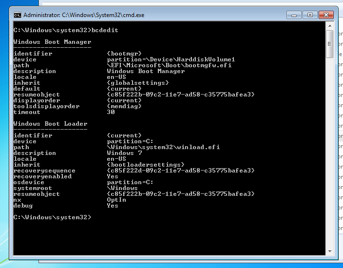
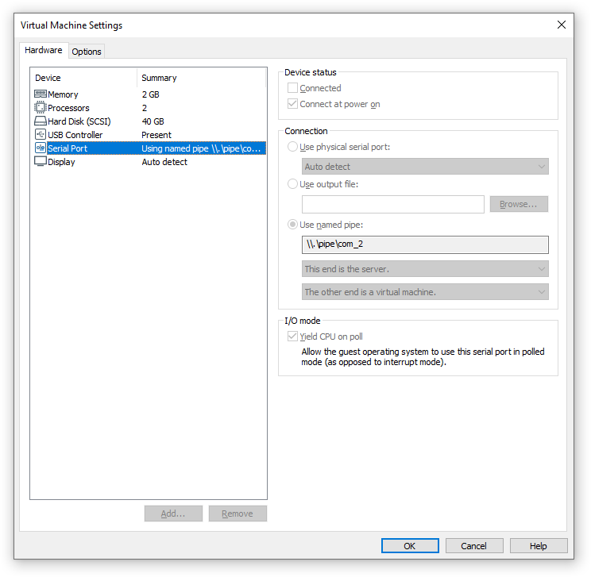
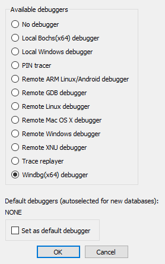
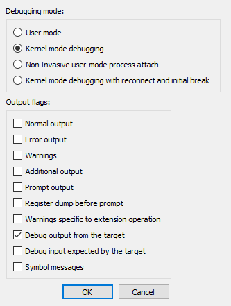
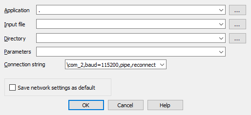
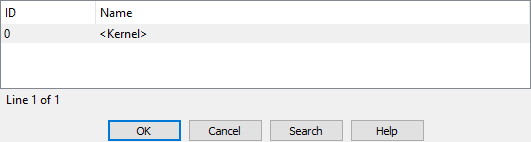
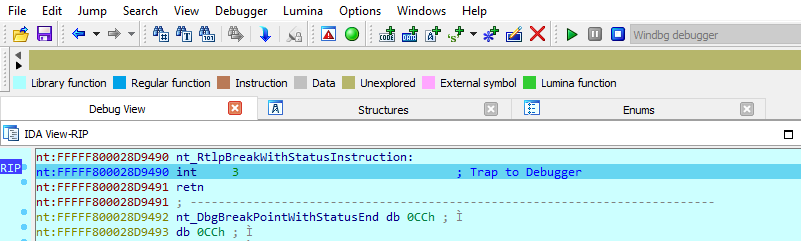
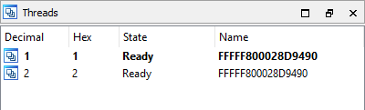
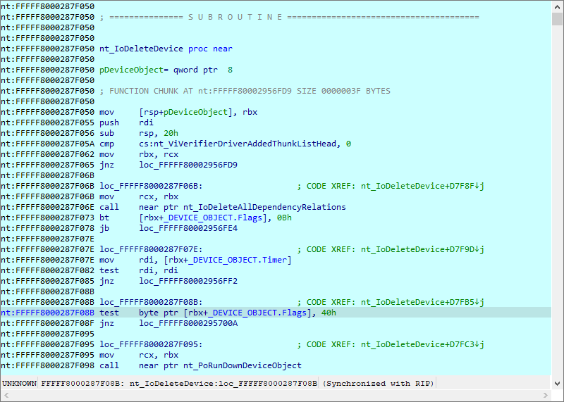

:source_os: Windows
:tutorial_title: Debugging the Windows Kernel with VMWare and IDA WinDbg Plugin
:target_bitness: 64-bit
:ida_binary: ida
:ida_version: 7.5SP2

= {tutorial_title}

:revn: 0.1
:revd: September 02
:revy: 2020

Last updated on {revd}, {revy} — v{revn}

We will now demonstrate how to debug the kernel through a virtual machine.

In this example we will be using VMware Workstation 15 Player and
Windows 7.

It is highly recommended to read the article
https://briolidz.wordpress.com/2012/03/28/windows-driver-debugging-with-windbg-and-vmware/[
Windows driver debugging with WinDbg and VMWare]

== Configuring the virtual machine

Run the VM and use the `bcedit` commandfootnote:[
or edit the `c:\boot.ini` file for Windows XP]
to configure the boot menu as stated in the article. 

Edit the VM hardware settings and add a new serial port with option
`use named pipe`:

Restart the VM to debug. At the boot prompt, select the menu item containing
`[debugger enabled]` from the boot menu.

== Configuring Windbg debugger plugin

The connection string `com:port=\\.\pipe\com_2,baud=115200,pipe,reconnect`
for Windbg plugin should refer to the named pipe we set up in the previous
steps.

=== Starting the debugger step by step

Start IDA Pro with an empty database:footnote:[
you can use any name of your choice instead of `sample`]

[source]
----
> ida64 -t sample.i64
----

Select the Windbg debugger using "Debugger > Select debugger":

Then configure it to use “Kernel mode debugging” debugging in the “Debugger
specific options” dialog:

After the debugger is properly configured, edit the process options and
set the connection string:footnote:[
specify any non-empty string for "Application" because IDA Pro does not
allow an empty string in this field]

Finally, start debugging using "Debugger > Attach to process":

IDA Pro may display a wait box "Refreshing module list" for some time.
Then it will display something like this:

=== Starting the debugger using a command line option

The simplest way to start WinDbg Plugin is to run IDA Pro with the following
option:

[source]
----
> ida64 -rwindbg{MODE=1}@com:port=\\.\pipe\com_2,baud=115200,pipe,reconnect+0 sample.i64
----

* `{MODE=1}` means "Kernel mode"
* `+0` means the "<Kernel>" process

== Debugging

In kernel mode IDA Pro will display one entry in the threads window for each
processor.

For example a two processor configurationfootnote:[
as was specified in the VM hardware settings] yields:

This screenshot shows how we are debugging the kernel and changing the
disassembly listing (renaming stack variables, or using structure offsets):

At the end you can detach from the kernel and resume it or detach from the
kernel and keep it suspended.

To detach and resume, simply select the “Debugger > Detach from process”,
however to detach and keep the kernel suspended select “Debugger > Terminate
Process”.

== Debugging the kernel through kdsrv.exe

In some cases, when debugging a 64bit kernel using a 1394 cable then 64bit
drivers are needed, thus dbgeng (32bits) will not work. To workaround this
problem we need to run the kernel debugger server from the x64 debugging
tools folder and connect to it:

* Go to “Debugging Tools (x64)” installation
* Run kdsrv.exe (change the port number/transport appropriately):
** `kdsrv -t tcp:port=6000`
* Now run ida64 and specify the following connection string (change the
transport value appropriately):
** `kdsrv:server=@{tcp:port=6000,server=127.0.0.1},trans=@{com:port=\\.\pipe\com_3,baud=115200,pipe}`

