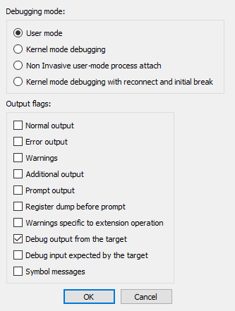
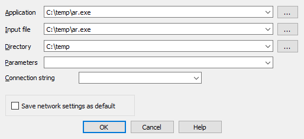
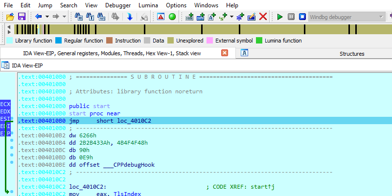
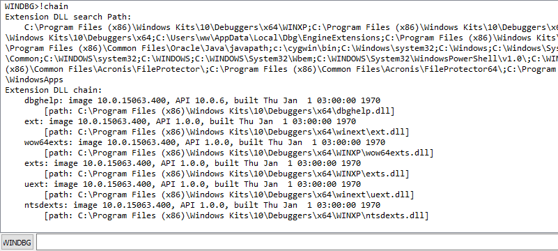
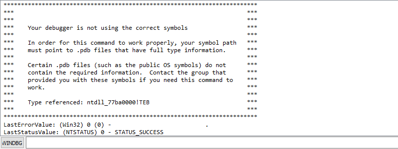
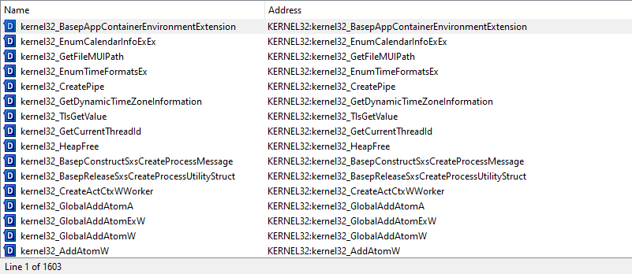
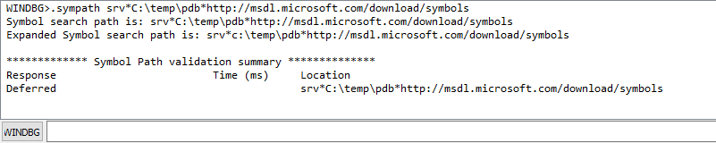
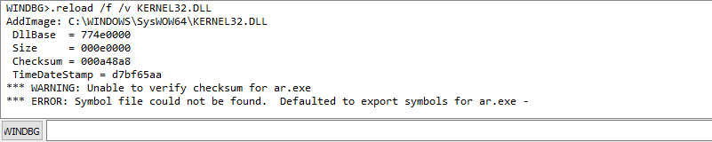
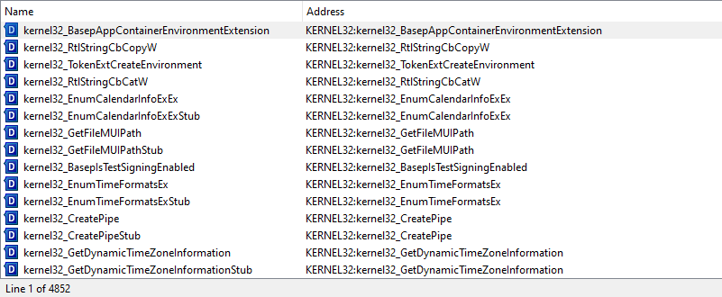
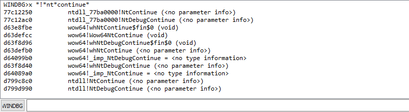

:source_os: Windows
:tutorial_title: Debugging Windows Applications with IDA WinDbg Plugin
:target_bitness: 32-bit
:ida_binary: ida
:ida_version: 7.5SP2

= {tutorial_title}

:revn: 0.1
:revd: August 18
:revy: 2020

Last updated on {revd}, {revy} — v{revn}

== Setup

The Windbg debugger plugin is an IDA Pro debugger plugin that uses
Microsoft's debugging engine (dbgeng) that is used by Windbg, Cdb or Kd.

To get started, you need to install the latest Debugging Tools from
Microsoft website:
https://docs.microsoft.com/ru-ru/windows-hardware/drivers/download-the-wdk[
Download the Windows Driver Kit (WDK)]
or from the Windows SDK / DDK package.

Please use *ar.exe.idb* from link:./samples.zip[samples.zip]
to follow this tutorial.

After installing the debugging tools, make sure you select "Debugger >
Switch Debugger" and select the WinDbg debugger.

Also make sure you specify the correct settings in the “Debugger specific
options” dialog:

User mode:: Select this mode for user mode application debugging (default mode)
Kernel mode:: Select this mode to attach to a live kernel.
Non Invasive debugging:: Select this mode to attach to a process
https://docs.microsoft.com/en-us/windows-hardware/drivers/debugger/noninvasive-debugging--user-mode-[non-invasively]
Output flags:: These flags tell the debugging engine which kind of output
messages to display and which to omit
Kernel mode debugging with reconnect and initial break:: Select this option
when debugging a kernel and when the connection string contains 'reconnect'.
This option will assure that the debugger breaks as soon as possible after a
reconnect.

To make these settings permanent, please edit the `%IDA%\cfg\dbg_windbg.cfg`
file.

*To specify the debugging tools folder* you may add to the PATH environment
variable the location of Windbg.exe or edit `%IDA%\cfg\ida.cfg` and change the
value of the DBGTOOLS key.

After the debugger is properly configured, edit the process options and
leave the connection string value empty because we intend to debug a local
user-mode application.

== Starting the debugger

Now hit F9 to start debugging:

The Windbg plugin is very similar to IDA Pro's Win32 debugger plugin,
nonetheless by using the former, one can benefit from the command line
facilities and the extensions that ship with the debugging tools.

For example, one can type `!chain` to see the registered Windbg extensions:

`!gle` is another command to get the last error value of a given Win32 API
call.

== Use of symbolic information

Another benefit of using the Windbg debugger plugin is the use of symbolic
information.

include::kernel32_a.txt[]

Normally, if the debugging symbols path is not set, then the module window
will only show the exported names.
For example kernel32.dll displays {kernel32_a} names:footnote:[
Double click at `KERNEL32.DLL` in `Modules` window to see this list.]

Let us configure a symbol source by adding this environment variable before
running IDA:

 set _NT_SYMBOL_PATH=srv*C:\temp\pdb*http://msdl.microsoft.com/download/symbols

It is also possible to set the symbol path directly while debugging
typing `.sympath srv*C:\temp\pdb*http://msdl.microsoft.com/download/symbols`
in the WINDBG console:

and then typing `.reload /f /v KERNEL32.DLL` to reload the symbols:

include::kernel32_b.txt[]

Now we try again and notice that more symbol names are retrieved from
kernel32.dll:

Now we have {kernel32_b} symbols instead!

It is also possible to use the `x *!*nt*continue` footnote:[
Looking for any symbol in any module that contains the word 'continue'
after 'nt'] command to quickly search for symbols:

== Debugging a remote process

We have seen how to debug a local user mode program, now let us see how to
debug a remote process. First let us assume that `pcA` is the target
machine (where we will run the debugger server and the debugged program) and
`pcB` is the machine where IDA Pro and the debugging tools are installed.

To start a remote process:

* On `pcA`, type: `dbgsrv -t tcp:port=5000` footnote:[
change the port number as needed]
* On `pcB`, setup IDA Pro and Windbg debugger plugin:
** *Application/Input file*:
these should contain a path to the debuggee residing in `pcA`
** *Connection string*: `tcp:port=5000,server=pcA`

Now run the program and debug it remotely.

To attach to a remote process, use the same steps to setup `pcA` and use the
same connection string when attaching to the process.

More about connection strings and different protocols (other than TCP/IP)
can be found in `debugger.chm` in the debugging tools folder.

